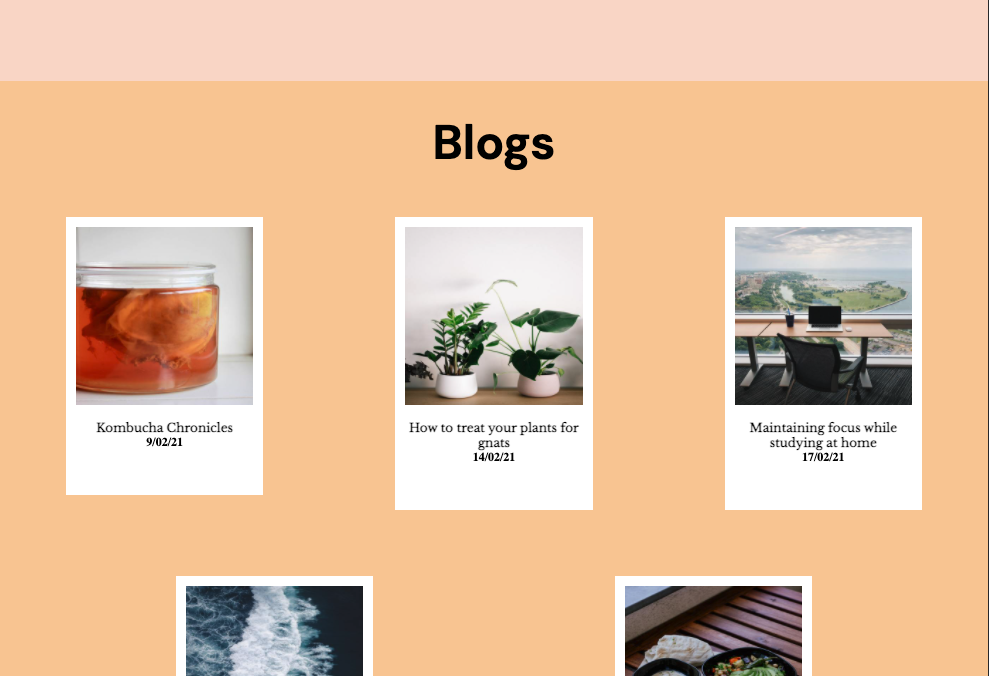
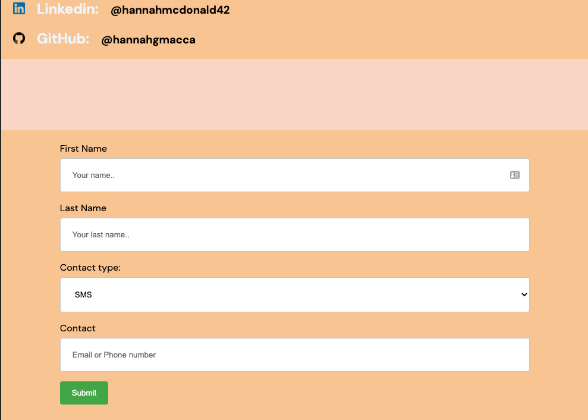
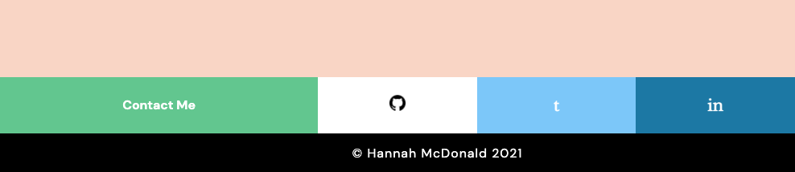

# Portfolio

## Links

[Live Portfolio](https://hmportfolio.netlify.app/index.html)

[GitHub](https://github.com/hannahgmacca/portfolio)

## Description

### Purpose

The purpose of this portfolio is to demonstrate to teachers and potential future employers who I am and what I am capable of.

This includes my personal interests, hobbies and styles. The website is also used to show my working history, education and a space to highlight my projects.

This portfolio itself also serves as an opportunity to advance my abilities in website development. It is a project that allows me to begin practicing new skills in HTML/CSS/Ruby/React + more, as I can update and add new features as I learn them.

### Functionality / Features

Current features include:
* Interactive navigation bar (Desktop)
* Dropdown navigation menu (Mobile / Tablet)
* Blog posts
* Link to resume PDF
* Interactive footer which links to my professional socials

### Sitemap

### Screenshots

#### Home

#### Blog

#### Resume

#### Contact

#### Footer

#### Mobile

### Target Audience

The target audience for the portfolio is classmates, teachers, friends, family and potential employers.

### Tech Stack

To create this website there was a combination of software tools, languages and resources used.

This includes:
* HTML
* CSS
* SASS
* Markdown
* Git
* GitHub
* Unsplash.com (for any images used)
* CodePen.com (for the foundation of my Footer HTML/CSS)
* W3Schools (key learning resource)
* Netlfiy (for deployment)
* Trello (task managment)
  